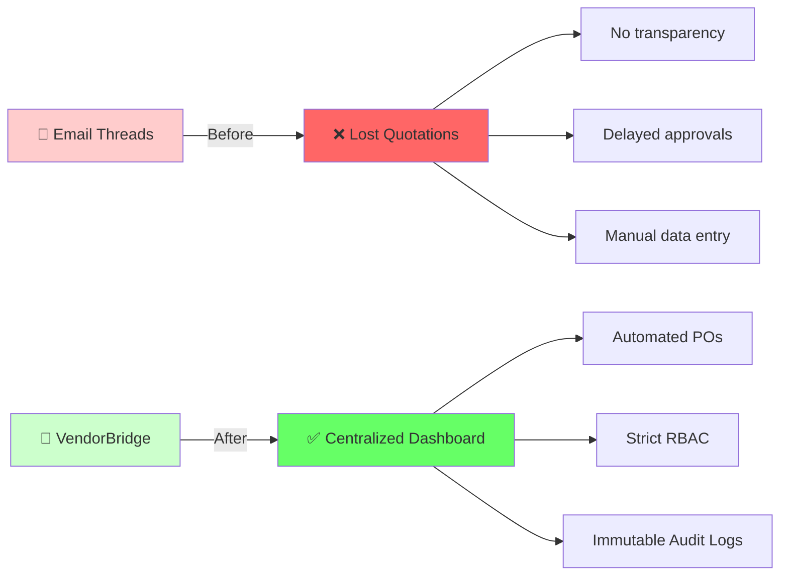
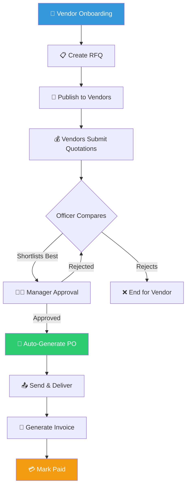
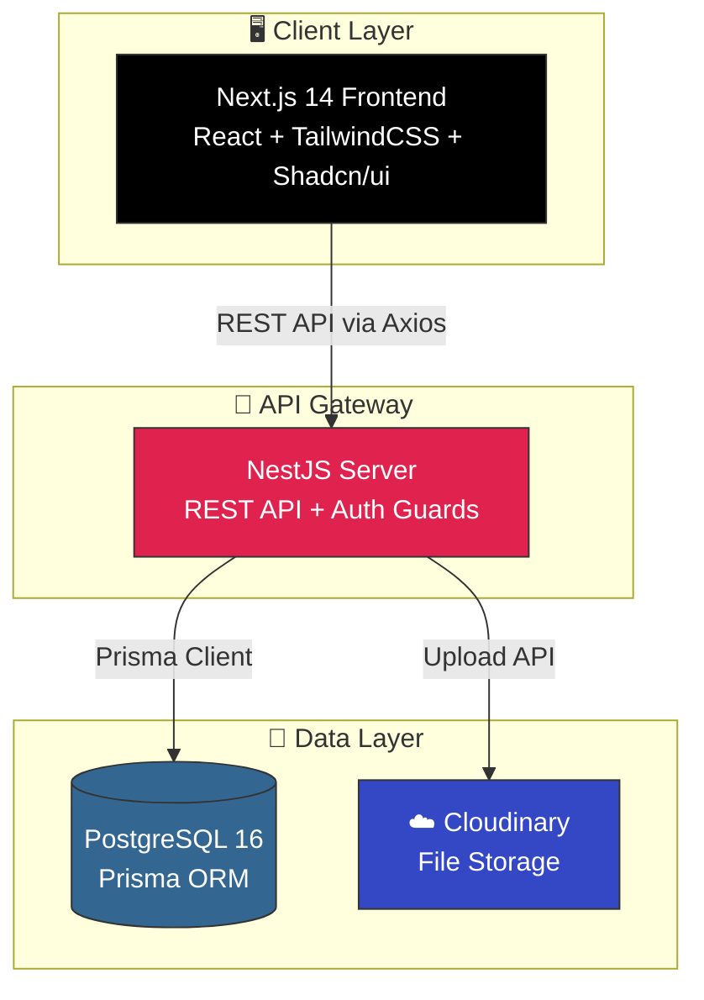

<p align="center">

</p>

<h1 align="center">VendorBridge - Procurement & Vendor Management ERP</h1>

<p align="center">
<strong>🚀 Digitizing the entire procurement cycle with structured workflows and immutable auditing</strong>
</p>

<p align="center">
   
</p>

<p align="center">
     
</p>

---

## 🎯 Overview

**VendorBridge** is a comprehensive, workflow-driven Enterprise Resource Planning (ERP) system built to completely digitize procurement pipelines between organizations and vendors. It replaces chaotic email threads, manual PDF generation, and unstructured negotiations with a strict, auditable, and automated digital ledger.

### 🌟 Why VendorBridge?



---

## ✨ Feature Highlights

### 🔥 Core Features

<table>
<tr>
<td width="50%">

#### 🏢 Procurement Operations
- ✅ Complete Vendor Lifecycle Management
- ✅ Dynamic RFQ Creation & Publishing
- ✅ Side-by-Side Quotation Comparison
- ✅ Automated PO Generation (PDF Export)
- ✅ Invoice Tracking & Payment Management
- ✅ Advanced Data Tables with Filtering
- ✅ In-app Notifications

</td>
<td width="50%">

#### ⚖️ Compliance & Security
- ✅ Strict Role-Based Access Control (RBAC)
- ✅ 4 Unique Tiers: Admin, Officer, Manager, Vendor
- ✅ Immutable Audit Logging (No UPDATE/DELETE)
- ✅ State-Machine Workflow Integrity
- ✅ Secure File/Evidence Attachments via Cloudinary
- ✅ Atomic Document Numbering Generation
- ✅ JWT Authentication

</td>
</tr>
</table>

---

## 🔄 The Procurement Workflow

Our highest priority is **Workflow Integrity**. No step may be bypassed, and every transition must be executed by the authorized role.



### 10-State Procurement Machine
1. **RFQ Lifecycle:** `Draft` → `Published` → `Closed` / `Cancelled`
2. **Quotation Lifecycle:** `Submitted` → `Shortlisted` → `Accepted` / `Rejected`
3. **Approval Lifecycle:** `Pending` → `Approved` / `Rejected`
4. **PO Lifecycle:** `Generated` → `Sent` → `Delivered`
5. **Invoice Lifecycle:** `Pending` → `Paid` / `Overdue`

---

## 👥 User Roles & Permissions

| Feature | ADMIN | OFFICER | MANAGER | VENDOR |
|---------|:------:|:---:|:-----------:|:-----:|
| Manage Vendors | ✅ | ❌ | ❌ | ❌ |
| Create & Publish RFQs | ✅ | ✅ | ❌ | ❌ |
| Submit Quotations | ❌ | ❌ | ❌ | ✅ |
| Compare & Shortlist | ✅ | ✅ | ❌ | ❌ |
| Approve Quotations | ❌ | ❌ | ✅ | ❌ |
| Generate POs & Invoices | ✅ | ✅ | ❌ | ❌ |
| View Audit Logs | ✅ | ❌ | ❌ | ❌ |

---

## 🏗️ System Architecture



---

## 🛠️ Tech Stack Details

### Frontend
- **Framework:** Next.js 14.2 (App Router)
- **UI Library:** Tailwind CSS + shadcn/ui
- **State & Data Fetching:** TanStack Query (React Query)
- **Forms & Validation:** React Hook Form + Zod
- **Tables:** TanStack Table

### Backend
- **Framework:** NestJS 10 (TypeScript)
- **Database ORM:** Prisma 5
- **Database Engine:** PostgreSQL 16
- **Auth:** JWT (RS256), argon2id hashing
- **PDF Generation:** PDFKit
- **Cloud Storage:** Cloudinary

---

## 📦 Quick Start Installation

**1. Clone & Install**
```bash
pnpm install
```

**2. Environment Configuration**
```bash
cp apps/api/.env.example apps/api/.env
cp apps/web/.env.example apps/web/.env
```

**3. Database Setup**
```bash
docker compose up -d postgres
pnpm --filter @vb/api prisma migrate deploy
pnpm run prisma:seed  # Populates the demo environment!
```

**4. Start Application**
```bash
pnpm dev
```
- **Web App:** `http://localhost:3000`
- **API:** `http://localhost:4000`

---

## 📚 Project Documentation
VendorBridge comes with an exhaustive suite of documentation located in the `/doc` folder:
- **Product:** Vision, Workflows, Screen references, Business rules.
- **Architecture:** API standards, Tech stack justifications, ER diagrams.
- **Platform:** Audit logging specs, Notifications, RBAC security model.

*Refer to the `/doc` folder for deep architectural insights into individual modules like `M01-AUTH`, `M04-RFQ`, and `M10-AUDIT-LOGS`.*

---

## 🏆 Hackathon Ready
<table>
<tr>
<td align="center">
<strong>🎯 Problem Statement</strong><br/>
Vendor Management ERP
</td>
<td align="center">
<strong>📂 Domain</strong><br/>
B2B Enterprise Software
</td>
<td align="center">
<strong>🛡️ Key Differentiator</strong><br/>
Strict Workflow State Machines & Compliance
</td>
</tr>
</table>
