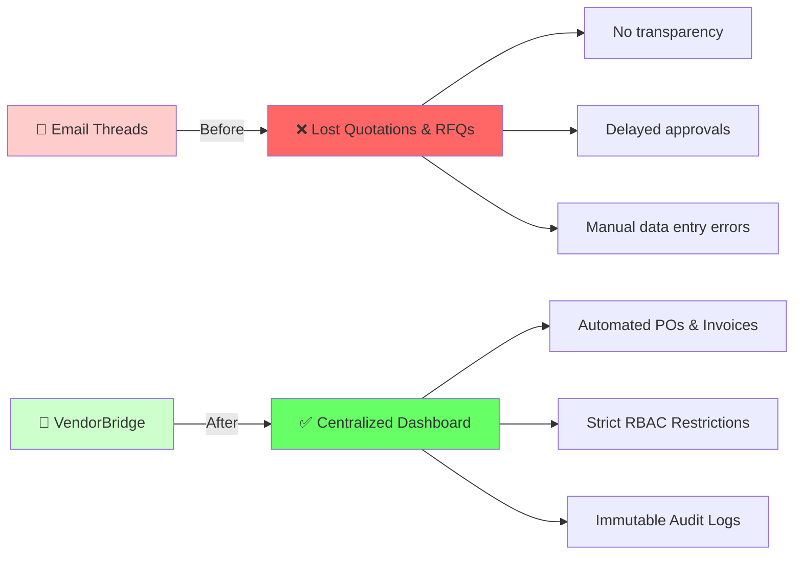
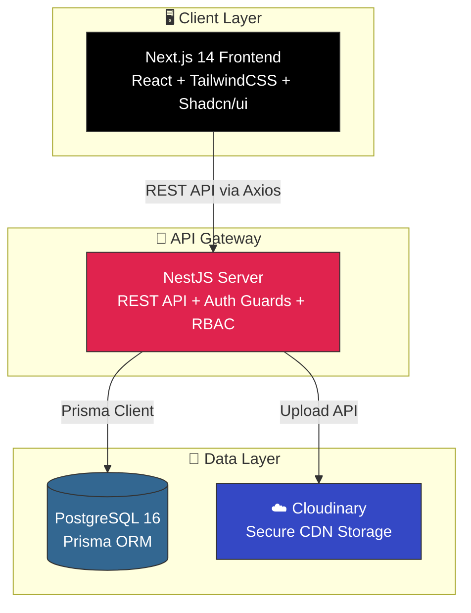
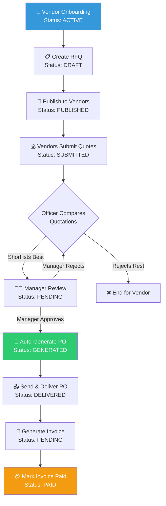
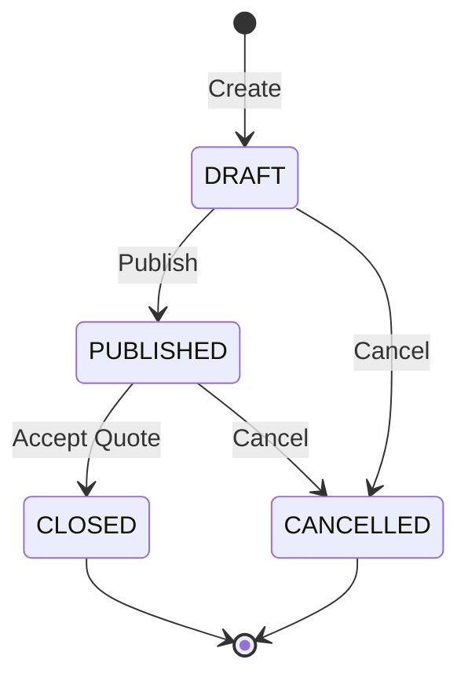
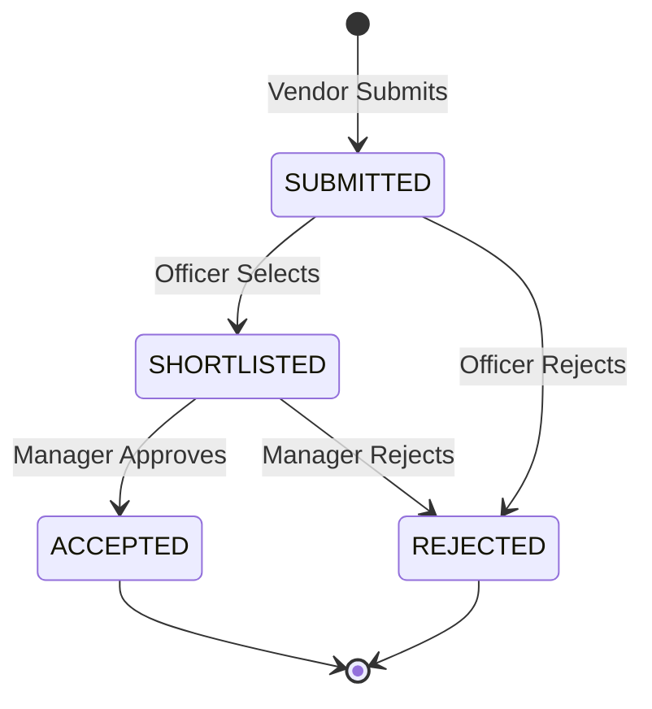
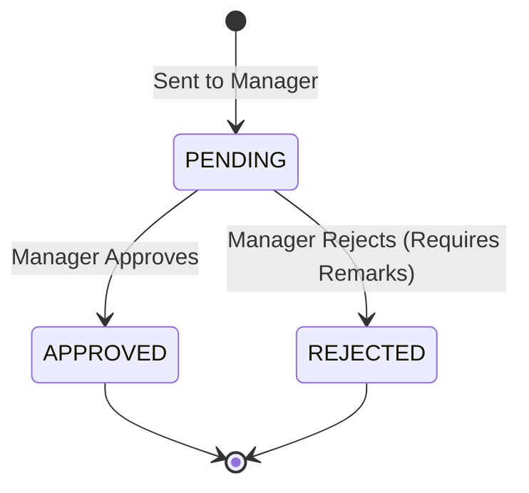

<p align="center">

</p>

<h1 align="center">VendorBridge - Enterprise Procurement & Vendor Management ERP</h1>

<p align="center">
<strong>🚀 Digitizing the entire procurement cycle with structured workflows, strict RBAC, and immutable auditing</strong>
</p>

<p align="center">
<a href="#-installation--setup">
    
</a>
<a href="#-full-documentation-index">
    
</a>
</p>

<p align="center">


</p>

<p align="center">


</p>

---

## 📋 Table of Contents

<details>
<summary>Click to expand</summary>

- [🎯 Overview](#-overview)
- [✨ Feature Highlights](#-feature-highlights)
- [🏗️ System Architecture](#️-system-architecture)
- [🔄 Detailed Data Flow & Workflows](#-detailed-data-flow--workflows)
- [📊 Case & Workflow Lifecycles](#-case--workflow-lifecycles)
- [👥 User Roles & Permissions](#-user-roles--permissions)
- [🛠️ Tech Stack & Justifications](#️-tech-stack--justifications)
- [🗄️ Database Schema Overview](#️-database-schema-overview)
- [🔐 Security & Compliance](#-security--compliance)
- [📡 API Documentation Reference](#-api-documentation-reference)
- [📦 Installation & Setup](#-installation--setup)
- [📚 Full Documentation Index](#-full-documentation-index)
- [📂 Project Structure](#-project-structure)
- [🧪 Testing Strategy](#-testing-strategy)
- [🚀 Deployment Architecture](#-deployment-architecture)
- [🤝 Contributing](#-contributing)
- [🏆 Hackathon Info](#-hackathon-info)

</details>

---

## 🎯 Overview

**VendorBridge** is a comprehensive, workflow-driven Enterprise Resource Planning (ERP) system built to completely digitize procurement pipelines between organizations and vendors. It replaces chaotic email threads, manual PDF generation, and unstructured negotiations with a strict, auditable, and automated digital ledger.

The core philosophy of VendorBridge is **Workflow Integrity**. This is **NOT** a simple CRUD application. It is a strictly governed state machine where no steps can be skipped, and every single action leaves an immutable audit trail.

### 🌟 Why VendorBridge?



### 🏆 Key Achievements & Scale

| Metric | Value |
|--------|-------|
| **Core Modules** | 12 |
| **User Roles** | 4 Distinct Tiers |
| **API Endpoints** | 45+ |
| **Database Tables** | 18 |
| **State Machines** | 5 (RFQ, Quote, Approval, PO, Invoice) |

---

## ✨ Feature Highlights

### 🔥 Core System Modules

<table>
<tr>
<td width="50%">

#### 🏢 Procurement Operations
- ✅ **Complete Vendor Lifecycle Management** (Active, Inactive, Blocked)
- ✅ **Dynamic RFQ Creation** with multi-line item mapping
- ✅ **Targeted Vendor Publishing** (Invite specific active vendors)
- ✅ **Side-by-Side Quotation Comparison** UI for Officers
- ✅ **Automated Purchase Order Generation** (Dynamic PDF Export)
- ✅ **Invoice Tracking** & Payment Marking Management
- ✅ **Advanced Data Tables** with comprehensive search & filtering

</td>
<td width="50%">

#### ⚖️ Compliance & Security
- ✅ **Strict Role-Based Access Control** (RBAC Checks at API & UI levels)
- ✅ **4 Unique Access Tiers**: Admin, Officer, Manager, Vendor
- ✅ **Immutable Audit Logging**: No UPDATE/DELETE allowed on logs
- ✅ **State-Machine Integrity**: Hard-coded transition validations
- ✅ **Secure File Attachments** via Cloudinary (No raw DB blobs)
- ✅ **Atomic Document Numbering** generation using Sequences
- ✅ **JWT Authentication** (RS256) with HttpOnly secure cookies

</td>
</tr>
</table>

### 🎨 UI/UX Features

| Feature | Description |
|---------|-------------|
| 📱 **Mobile Responsive** | Fully fluid UI works across desktops and tablets. |
| 🔔 **In-App Notifications** | Real-time database-driven alerts for workflow state changes. |
| 📊 **Analytics Dashboard** | Visual charts (Recharts) for spend by vendor and monthly trends. |
| 🔍 **Advanced Filtering** | TanStack Table-powered column filtering, sorting, and global search. |
| 📄 **Dynamic PDF Generation** | Server-side PDFKit document rendering for POs and Invoices. |
| 🛡️ **Role-Based Views** | UI components physically render conditionally based on Auth State. |

---

## 🏗️ System Architecture

### High-Level Architecture Flow



### Detailed Component Architecture

```text
┌─────────────────────────────────────────────────────────────────────────────┐
│                              CLIENT LAYER                                    │
├─────────────────────────────────────────────────────────────────────────────┤
│  Next.js 14 (App Router) │ TypeScript │ TailwindCSS │ shadcn/ui │ React Hook │
│  ┌─────────────┐  ┌─────────────┐  ┌─────────────┐  ┌─────────────┐        │
│  │ Server Comps│  │ Client Comps│  │ TanStack Q. │  │ ZustandAuth │        │
│  └─────────────┘  └─────────────┘  └─────────────┘  └─────────────┘        │
└─────────────────────────────────────────────────────────────────────────────┘
                                    │
                                    │ HTTPS / REST (JWT Headers)
                                    ▼
┌─────────────────────────────────────────────────────────────────────────────┐
│                              BACKEND LAYER                                   │
├─────────────────────────────────────────────────────────────────────────────┤
│  NestJS 10 │ TypeScript │ Prisma ORM │ JWT │ Class Validator                 │
│  ┌─────────────┐  ┌─────────────┐  ┌─────────────┐  ┌─────────────┐        │
│  │ Auth Guards │──│ Controllers │──│  Services   │──│   Prisma    │        │
│  │ RBAC Meta   │  │   Routes    │  │ State Logic │  │   Client    │        │
│  └─────────────┘  └─────────────┘  └─────────────┘  └──────┬──────┘        │
└────────────────────────────────────────────────────────────┼────────────────┘
                                                             │
                                                             ▼
                                                ┌────────────────────────────┐
                                                │      PostgreSQL DB         │
                                                ├────────────────────────────┤
                                                │  18 Tables │ 8 Enums       │
                                                │  Strict Audit Logging      │
                                                └────────────────────────────┘
```

---

## 🔄 Detailed Data Flow & Workflows

The fundamental rule of VendorBridge is that **No workflow step may be skipped.**



### Key Business Rules Enforced (Backend & Frontend)
- **BR-001**: An RFQ must have at least one assigned active vendor to be published.
- **BR-002**: RFQ deadlines must be strictly in the future.
- **BR-003**: A Quotation cannot be submitted or edited after the RFQ deadline has passed.
- **BR-004**: Approvals require an explicitly submitted quotation.
- **BR-005**: A Purchase Order CANNOT be generated without an APPROVED quotation.
- **BR-006**: An Invoice CANNOT be generated without a corresponding Purchase Order.
- **BR-007**: Audit Logs are completely immutable.

---

## 📊 Case & Workflow Lifecycles

VendorBridge uses rigid state machines for every core entity to prevent invalid data states.

### 1. RFQ State Machine


### 2. Quotation State Machine


### 3. Approval State Machine


### 4. PO & Invoice State Machines
- **Purchase Order:** `GENERATED` → `SENT` → `DELIVERED`
- **Invoice:** `PENDING` → `PAID` / `OVERDUE`

---

## 👥 User Roles & Permissions

The system operates on a 4-tier Role-Based Access Control (RBAC) model. Permissions are enforced via NestJS `@Roles()` decorators on the backend and Zustand Auth Store conditional rendering on the frontend.

| Feature | ADMIN 👑 | OFFICER 👮 | MANAGER 👨‍💼 | VENDOR 🏢 |
|---------|:------:|:---:|:-----------:|:-----:|
| **Vendor Management** | | | | |
| Create/Edit Vendors | ✅ | ❌ | ❌ | ❌ |
| View All Vendors | ✅ | ✅ | ✅ | ❌ |
| **RFQ Management** | | | | |
| Create & Publish RFQs | ✅ | ✅ | ❌ | ❌ |
| View Assigned RFQs | ✅ | ✅ | ✅ | ✅ |
| Cancel RFQs | ✅ | ✅ | ❌ | ❌ |
| **Quotation Management** | | | | |
| Submit Quotations | ❌ | ❌ | ❌ | ✅ |
| View Own Quotations | ❌ | ❌ | ❌ | ✅ |
| Compare & Shortlist | ✅ | ✅ | ❌ | ❌ |
| **Approval Management** | | | | |
| Approve/Reject Quotes | ❌ | ❌ | ✅ | ❌ |
| View Approvals | ✅ | ✅ | ✅ | ❌ |
| **Financials** | | | | |
| Generate POs | ✅ | ✅ | ❌ | ❌ |
| Generate Invoices | ✅ | ✅ | ❌ | ❌ |
| Mark Invoices Paid | ✅ | ✅ | ❌ | ❌ |
| View Own Financials | ❌ | ❌ | ❌ | ✅ |
| **System** | | | | |
| View System Dashboard | ✅ | ✅ | ✅ | ❌ |
| View Immutable Audits | ✅ | ❌ | ❌ | ❌ |

---

## 🛠️ Tech Stack & Justifications

### Frontend Client
- **Framework:** Next.js 14.2 (App Router) - Provides robust routing, fast rendering, and API proxying.
- **UI Library:** Tailwind CSS + shadcn/ui - Best-in-class utility styling with accessible, headless components.
- **State & Data Fetching:** TanStack Query (React Query) - Handles all caching, background syncing, and loading states automatically.
- **Forms & Validation:** React Hook Form + Zod - Strictly typed form schemas that match backend validations.
- **Tables:** TanStack Table - Headless table management for advanced data grids.

### Backend Server
- **Framework:** NestJS 10 (TypeScript) - Enterprise-grade structure, dependency injection, and scalable module architecture.
- **Database ORM:** Prisma 5 - Fully type-safe database access, automated migrations, and easy relationship handling.
- **Database Engine:** PostgreSQL 16 - Chosen for its robustness, JSON support, and relational integrity.
- **Auth:** JWT (RS256) & argon2id - Industry-standard secure token handling and memory-hard password hashing.
- **PDF Generation:** PDFKit - Server-side rendering of pixel-perfect POs and Invoices to prevent client tampering.
- **Cloud Storage:** Cloudinary - Offloads heavy document/image storage from the primary database, storing only URLs.

---

## 🗄️ Database Schema Overview

The relational database is strictly normalized. Below are the primary entities and their relationships:

| Table Name | Purpose | Key Relationships |
|------------|---------|-------------------|
| `users` | System accounts (Admin, Officer, Manager) | Links to Audit Logs, Approvals |
| `vendors` | Vendor company details | Links to RFQs, Quotations, POs |
| `vendor_users` | Accounts belonging to a vendor | Links to `vendors` |
| `rfqs` | Request for Quotation definitions | Has many `rfq_line_items` |
| `rfq_vendors` | Many-to-many map of RFQs to invited Vendors | Links `rfqs` to `vendors` |
| `quotations` | Bids submitted by vendors | Belongs to `rfqs` and `vendors` |
| `approvals` | Manager sign-offs | Belongs to `quotations` |
| `purchase_orders`| Finalized orders | Belongs to `approvals` |
| `invoices` | Billing records | Belongs to `purchase_orders` |
| `audit_logs` | Immutable system event ledger | Tracks `action`, `entityType`, `userId` |
| `sequence_tracker`| Atomic counter for document IDs | `(RFQ-YYYY-0001, PO-YYYY-0001)` |

---

## 🔐 Security & Compliance

VendorBridge is built with enterprise security in mind:

### 1. Immutable Audit Logging
Every single critical action generates an `AuditLog` entry. 
- **Rule:** The `AuditLog` table strictly allows `INSERT`.
- **Rule:** `UPDATE`, `DELETE`, and even `SOFT DELETE` are completely prohibited at the application layer.
- **Examples Logged:** RFQ Published, Quotation Submitted, Approval Rejected, PO Generated, Invoice Paid.

### 2. Authorization (RBAC)
- **API Protection:** Endpoints are protected by `JwtAuthGuard` and `RolesGuard`. If a Vendor tries to POST to `/api/rfqs`, the NestJS guard intercepts and returns `403 Forbidden` before the controller even executes.
- **Data Siloing:** Vendors can only fetch data where `vendorId === req.user.vendorId`.

### 3. Password Hashing
- We utilize `argon2id`, the winner of the Password Hashing Competition, to protect all credentials against GPU cracking.

---

## 📡 API Documentation Reference

The backend exposes a highly RESTful API. Below is a subset of core endpoints. All endpoints require a valid `Bearer <Token>`.

### 🔐 Authentication
```http
POST   /api/auth/login        # Returns JWT Token
GET    /api/auth/me           # Get current user profile
```

### 📋 RFQ Management
```http
POST   /api/rfqs              # [ADMIN, OFFICER] Create RFQ
GET    /api/rfqs              # List RFQs (Filtered by role)
GET    /api/rfqs/:id          # Get RFQ details + Line Items
PUT    /api/rfqs/:id/publish  # [ADMIN, OFFICER] Change state to PUBLISHED
```

### 💰 Quotation Management
```http
POST   /api/quotations        # [VENDOR] Submit new quote
GET    /api/quotations/compare/:rfqId # [OFFICER] Side-by-side comparison
```

### 👨‍💼 Approvals
```http
POST   /api/approvals         # [OFFICER] Request approval for quotation
PUT    /api/approvals/:id     # [MANAGER] Approve or Reject (w/ remarks)
```

### 📄 Document Generation (PDFs)
```http
GET    /api/purchase-orders/:id/pdf  # Returns binary Blob
GET    /api/invoices/:id/pdf         # Returns binary Blob
```

---

## 📦 Installation & Setup

### Prerequisites
- **Node.js** ≥ 20.0
- **pnpm** (Package manager)
- **Docker** (For PostgreSQL)

### Quick Start (Local Development)

**1. Clone the repository and install dependencies:**
```bash
git clone https://github.com/Kalpan2007/Odoo_X_KSX_VendorBridge.git
cd Odoo_X_KSX_VendorBridge
pnpm install
```

**2. Setup Environment Variables:**
```bash
cp apps/api/.env.example apps/api/.env
cp apps/web/.env.example apps/web/.env
```
*(Ensure you add your Cloudinary API keys to the backend `.env` if testing file uploads).*

**3. Start the Database:**
```bash
docker compose up -d postgres
```

**4. Run Migrations & Seed the Database:**
This will build the schema and populate the massive, fully-connected dataset needed for demonstrations.
```bash
pnpm --filter @vb/api prisma migrate deploy
pnpm run prisma:seed
```

**5. Start the Application:**
This command starts both the NestJS API and the Next.js Frontend concurrently.
```bash
pnpm dev
```

### Access Points
- **Frontend Dashboard:** `http://localhost:3000`
- **Backend API Base URL:** `http://localhost:4000`
- **Test Credentials:**
  - Admin: `admin@vendorbridge.local` / `Password123!`
  - Officer: `officer@vendorbridge.local` / `Password123!`
  - Manager: `manager@vendorbridge.local` / `Password123!`
  - Vendor: `vendor@acme.example` / `Password123!`

---

## 📚 Full Documentation Index

All project documentation lives in the [`doc/`](doc/) folder. **If there is a conflict, the code and `AGENTS.md` are the single source of truth.**

| Category | # | Document | Purpose |
|----------|---|----------|---------|
| **Product** | 01 | [PRODUCT-VISION](doc/01-product/01-PRODUCT-VISION.md) | Problem, vision, scope, non-goals |
| | 02 | [USER-ROLES](doc/01-product/02-USER-ROLES.md) | 4 roles, capabilities, RBAC matrix |
| | 03 | [SCREENS](doc/01-product/03-SCREENS.md) | All 10 screens from the spec |
| | 09 | [WORKFLOWS](doc/01-product/09-WORKFLOWS.md) | All state machines, transition rules |
| | 10 | [BUSINESS-RULES](doc/01-product/10-BUSINESS-RULES.md) | All validation and workflow rules (BR-001 …) |
| **Architecture**| 04 | [ARCHITECTURE](doc/02-architecture/04-ARCHITECTURE.md) | System architecture, request flow, topology |
| | 05 | [TECH-STACK](doc/02-architecture/05-TECH-STACK.md) | Every technology + justification |
| | 06 | [MODULE-STRUCTURE](doc/02-architecture/06-MODULE-STRUCTURE.md) | Feature-based module layout, folder conventions |
| | 07 | [DATA-MODEL](doc/02-architecture/07-DATA-MODEL.md) | ER diagram, entity descriptions, indexes |
| | 08 | [API-STANDARDS](doc/02-architecture/08-API-STANDARDS.md) | URL conventions, response format, error catalog |
| **Platform** | 11 | [AUDIT-LOGS](doc/03-platform/11-AUDIT-LOGS.md) | Audit log immutability spec, event catalog |
| | 12 | [NOTIFICATIONS](doc/03-platform/12-NOTIFICATIONS.md) | In-app notification design, future channels |
| | 13 | [SECURITY](doc/03-platform/13-SECURITY.md) | Auth, RBAC, ownership checks, threat model |

---

## 📂 Project Structure

VendorBridge utilizes a Monorepo structure managed by pnpm workspaces.

```text
VendorBridge/
├── 📁 apps/                    
│   ├── 📁 api/                 # NestJS Backend Application
│   │   ├── prisma/             # Schema, migrations, seed scripts
│   │   └── src/
│   │       ├── common/         # Decorators, Guards, Interceptors
│   │       ├── modules/        # Feature Modules (Auth, RFQs, POs, etc)
│   │       └── main.ts         # Server entry point
│   │
│   └── 📁 web/                 # Next.js Frontend Application
│       └── src/
│           ├── app/            # App Router Pages
│           ├── components/     # UI Components (shadcn, forms, charts)
│           ├── hooks/          # Custom React Hooks
│           ├── lib/            # Utilities, API client (Axios)
│           └── stores/         # Zustand State Management
│
├── 📁 doc/                     # Comprehensive Markdown Documentation
├── 📄 AGENTS.md                # System business rules reference
├── 📄 package.json             # Root workspace configuration
└── 📄 README.md                # This file
```

---

## 🧪 Testing Strategy

VendorBridge relies on rigorous automated testing.
- **Backend Unit Tests:** Jest-based testing of individual services, ensuring all state machine transitions fail appropriately when rules are broken.
- **E2E Tests:** Supertest is used to validate full endpoint lifecycles (e.g., from RFQ creation to Quotation submission).

```bash
# Run Backend Tests
pnpm --filter @vb/api test
```

---

## 🚀 Deployment Architecture

VendorBridge is built to be deployed on modern cloud infrastructure.

- **Frontend:** Deployed to **Vercel** or **AWS Amplify** for edge caching and fast CDN delivery.
- **Backend:** Packaged via Docker and deployed to **Render**, **Railway**, or **AWS ECS** for scalable Node.js execution.
- **Database:** Managed PostgreSQL instance on **Supabase**, **Neon**, or **AWS RDS**.
- **Storage:** **Cloudinary** handles all static asset distribution.

---

## 🤝 Contributing

We welcome contributions! Please follow these steps:

1. **Fork** the repository
2. **Create** a feature branch: `git checkout -b feature/amazing-feature`
3. **Commit** your changes: `git commit -m 'feat: Add amazing feature'`
4. **Push** to the branch: `git push origin feature/amazing-feature`
5. **Open** a Pull Request

### Code Style Expectations
- Use strict TypeScript typings.
- Format with Prettier before committing.
- Ensure all business rules in `AGENTS.md` are respected.

---

## 🏆 Hackathon Info

<table>
<tr>
<td align="center">
<strong>🎯 Problem Statement</strong><br/>
Vendor Management ERP
</td>
<td align="center">
<strong>📂 Domain</strong><br/>
B2B Enterprise Software
</td>
<td align="center">
<strong>🛡️ Key Differentiator</strong><br/>
Strict Workflow State Machines & Compliance
</td>
</tr>
</table>

---

<div align="center">

**Built with ❤️ for the Hackathon by Team VendorBridge**

</div>
